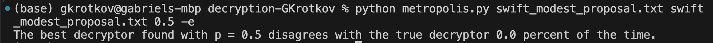
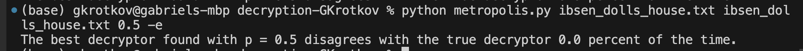
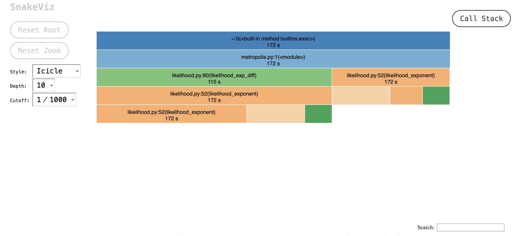
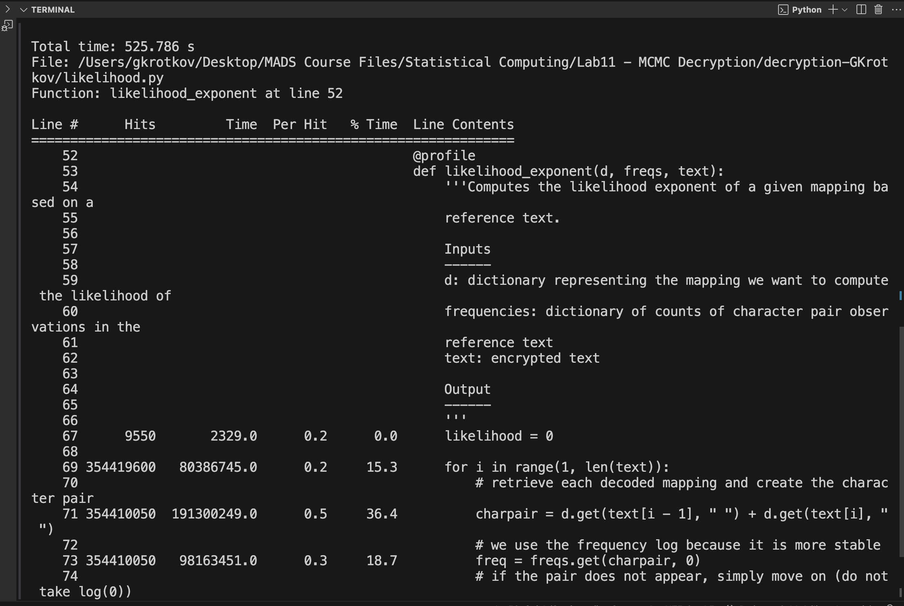

ChatGPT used as a collaborator for generating test cases. 

```{r setup, include = FALSE}
knitr::opts_chunk$set(echo = FALSE)
```

# Problem 1

It is not plausible to use brute-force maximization of $L$ to solve the problem, because you would need to manually search the entire space of $d$, the candidate decryptions mapping the alphabet to itself. This space is proportional of $n!$, where $n$ is the size of the alphabet. This grows obscenely quickly, making an exhaustive brute force search implausible.

# Problem 2

For one, I will need to represent a mapping of the sequence $c$ to itself in a way that makes retrieving the information efficient. A dictionary seems like the obvious choice to do this. Given an alphabet with constant size, which I believe we have for this problem, inverting the dictionary so that we can go back and forth efficiently does not need to be particularly fast.

I will need a function that computes $L(d)$ for a given decryption, and another function that takes two candidate decryptions and computes their likelihood ratio. To compute the likelihood of a given decryption I will need to be able to get the frequency of the relevant character pairs in a reference text. This loading should only happen once, since it will likely be an expensive operation, so I need a function that takes a reference text and processes it into an efficient format to retrieve the frequency of a character pair. Since checking for inclusion is not really relevant to the operations I expect to perform on this data (we know what's included - the alphabet) the difference between a dictionary and a 2D array is unlikely to matter for the speed of this implementation. Given that, and that fact that accessing into the array will likely be easier, I plan to use a 2D array to represent the frequency of character pairs. Lastly, I will need a function that generates a new candidate decryption given the previous one.

It makes sense to package the likelihood computation into a single module (`likelihood.py`), the reference text processing into its own module, say `process_reference.py`, (since it does not make sense to unit test that operation), and then have a separate driver file (`metropolis.py`) that uses these functions to execute the Metropolis algorithm. The key functions in `likelihood.py` will be tested by `test_likelihood.py`, but the driver code in `metropolis.py` should not need unit testing.

# Problem 3

I used the python debugger to identify how quickly my likelihood functions were growing, which helped me to identify that I needed to implement even more computation stabilization than was outlined in the project assignment. I did this by setting breakpoints inside the key likelihood computation functions and stepping inside those functions 

I used ChatGPT to generate some test cases for functions I wrote in `likelihood.py`. It generally smoothed this process, generating a lot of usable test cases. However, it wasn't a true replacement for thinking through edge cases - multiple key substitutions were required for me to have confidence the unit tests were effective.

One key change from my design I made to a get to a correct implementation was further stabilizing the computation following the below procedure. 

$U < (\frac{L(d')}{L(d)})^p$ is the comparison we make to determine whether to update the current mapping to the new mapping. Say we have a function $f(d)$ which computes the sum of the logged frequencies of all character pairs in the encrypted text in the reference text. Then, by applying log rules we can rewrite that comparison as: $(U)^{1/p} < e^{f(d') - f(d)}$ and then further rewrite to an easier computation as $log(U^{1/p}) < f(d') - f(d)$. Taking the log of a quantity bounded between 0 and 1 is much easier computationally than taking the exp of a possibly-very-large quantity, so this stabilizing made my algorithm much less computationally intensive. 

Another key change from the plan to the implementation, my plan did not really account for algorithmically handling the texts and processes them robustly. I implemented a module `manage_text` which handled encryption and decryption of text given a lookup key for the encryption, as well as reading & writing to files and pickling key python objects to pass between pipeline runs.

# Problem 4

When using the same reference text and randomly encrypting that text, my implementation of the metropolis algorithm with $p = 0.5$ is reliably able to find the optimal decryption mapping, demonstrated with the below runs of the algorithm on "A Modest Proposal" by Swift and "A Doll's House" by Ibsen.





# Problem 5

The algorithm still works if the reference text and the encryption text are different, but the variability of the algorithm's performance relative to $p$ is much higher. With an early stop condition of failing to improve on the best likelihood for 1500 iterations, my implementation of the Metropolis algorithm mostly succeeded at identifying the true decryption mapping, but occasionally spiked to extremely high levels of disagreement with the true decryptor, as shown in the table below.

$p$ | run 1 % disagreement | run 2 % disagreement | run 3 % disagreement
----|----------------------|----------------------|-----------------------
0.1 | 0.269 | 0 | 0
0.25| 0 | 0.07 | 0
0.5 | 0 | 0 | 0.885
0.75 | 0 | 0.897 | 0
1 | 0 | 0 | 0
3 | 0 | 0 | 0
5 | 0 | 0 | 0
10 | 0 | 0 | 0

Based on timing runs based on different lengths of text, it appears that the runtime is primarily proportional to the length of the encrypted text, since all the likelihood math scales proportional to that length. The length of the reference text does impact runtime, but on a much smaller scale.

On average, the algorithm converges to approximately the best mapping within around 3000 iterations. This is why I implemented an early stop condition where the program will halt if it fails to improve on the best likelihood after 1500 iterations.

# Problem 6

I did obtain a sensible result - the text is clearly decoded into text from Alice in Wonderland.

# Problem 7

**function profiling**

I performed function profiling and visualized the results with `snakeviz`, shown below. 



**line profiling**

I performed line profiling as shown below. 



Judging by both profiling methods, the vast majority of the script's time is spent computing the likelihood exponent. I have already focused on speeding this computation (we only compute the exponent, and move the exp to a log on the other side of the comparison, as outlined in (3), but a step I have not yet taken is vectorizing the computation in any way. Is it possible that taking a Map/Reduce approach could further improve the computation. The line profiling in particular shows that most of the time was spent in dictionary accessing via the `get` method, indicating that perhaps I could improve my access time somehow by not relying on the `get` method.

Another optimization I have not taking is parallelization. It seems that reimplementing the code to take advantage of parallel processes would be a difficult challenge, but there's no reason it's impossible.

# Problem 8

I created a distribution package with metadata and a wheel file and pushed it to my GitHub repo.

# Problem 9

I have submitted the final repository to GitHub and ensured that my code passes pytest and flake8.